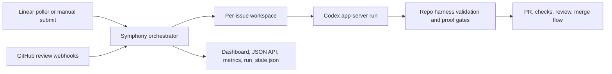

# Symphony

Symphony is a runtime-owned delivery engine for autonomous software work. It turns issue intake
into isolated implementation runs with explicit proof gates, policy controls, and operator
visibility.

This repository is the active `gaspardip/symphony` fork of the upstream
[`openai/symphony`](https://github.com/openai/symphony) project. It keeps tracking the upstream
spec while extending the self-hosted Elixir implementation and the repo-owned harness used to run
Symphony on itself.

[](.github/media/symphony-demo.mp4)

_In this [demo video](.github/media/symphony-demo.mp4), Symphony monitors a Linear board for work
and spawns agents to handle the tasks. The agents complete the tasks and provide proof of work: CI
status, PR review feedback, complexity analysis, and walkthrough videos. When accepted, the agents
land the PR safely. Engineers do not need to supervise Codex; they can manage the work at a higher
level._

> [!WARNING]
> This fork is still prototype software intended for trusted environments and active dogfooding.

## What This Fork Includes

Compared with the upstream project README, this fork already includes a working self-host path with:

- an Elixir/OTP orchestration service under [`elixir/`](./elixir)
- Linear-backed intake plus manual issue submission
- GitHub webhook intake for PR review follow-up
- isolated per-issue workspaces and persisted runtime state
- a Phoenix dashboard, JSON control API, and Prometheus metrics endpoint
- a repo-owned self-host harness under [`.symphony/harness.yml`](./.symphony/harness.yml)

## Use This Repo Or The Upstream Spec?

Use this fork if you want a concrete, self-hostable implementation with repo-owned operational
docs, harness checks, observability surfaces, and dogfood workflows.

Use the upstream [`SPEC.md`](./SPEC.md) if you want the product contract without inheriting this
fork's operational opinions.

## Quickstart

For the checked-in Elixir workflow in this repo, you need:

- `git`
- `gh` with an authenticated session
- `mise`
- `make`
- `codex`
- `LINEAR_API_KEY` exported in your shell

Then:

```bash
git clone https://github.com/gaspardip/symphony.git
cd symphony
export LINEAR_API_KEY=your_linear_token
./scripts/symphony-preflight.sh
cd elixir
mise exec -- mix build
mise exec -- ./bin/symphony \
  --i-understand-that-this-will-be-running-without-the-usual-guardrails \
  --port 4040 \
  ./WORKFLOW.md
```

Once the server is up:

- dashboard: `http://127.0.0.1:4040/`
- state API: `http://127.0.0.1:4040/api/v1/state`
- metrics: `http://127.0.0.1:4040/metrics`

If you want to drive the runtime without Linear, use the manual intake flow in
[`docs/MANUAL_RUNS.md`](./docs/MANUAL_RUNS.md).

## Runtime Flow



## First Places To Look

- Product and runtime contract: [`SPEC.md`](./SPEC.md)
- Elixir implementation and local run instructions: [`elixir/README.md`](./elixir/README.md)
- Self-host harness contract: [`docs/AGENT_HARNESS.md`](./docs/AGENT_HARNESS.md)
- Observability runbook: [`docs/OBSERVABILITY_RUNBOOK.md`](./docs/OBSERVABILITY_RUNBOOK.md)
- Manual intake flow: [`docs/MANUAL_RUNS.md`](./docs/MANUAL_RUNS.md)
- Self-dogfood operations: [`docs/DOGFOOD_OPERATIONS.md`](./docs/DOGFOOD_OPERATIONS.md)

## Repo-Owned Commands

The main entry point is the Elixir implementation in [`elixir/`](./elixir). From the repo root,
the repo-owned harness commands are:

```bash
./scripts/symphony-preflight.sh
./scripts/symphony-validate.sh
./scripts/symphony-smoke.sh
./scripts/symphony-artifacts.sh
```

The validation contract runs the in-repo harness check plus the Elixir quality gates:

```bash
cd elixir
mise exec -- mix harness.check
mise exec -- make all
```

For installation, workflow configuration, and runtime flags, use
[`elixir/README.md`](./elixir/README.md).

## Upstream Relationship

This fork keeps the upstream `SPEC.md` as the product baseline, but the implementation and
operational docs here reflect fork-specific work such as:

- self-host harness enforcement in [`.symphony/`](./.symphony)
- dogfood runner promotion and rollback flows in [`docs/DOGFOOD_OPERATIONS.md`](./docs/DOGFOOD_OPERATIONS.md)
- local observability and dashboard support in [`docs/OBSERVABILITY_RUNBOOK.md`](./docs/OBSERVABILITY_RUNBOOK.md)
- manual runtime intake in [`docs/MANUAL_RUNS.md`](./docs/MANUAL_RUNS.md)

## License

This project is licensed under the [Apache License 2.0](LICENSE).
